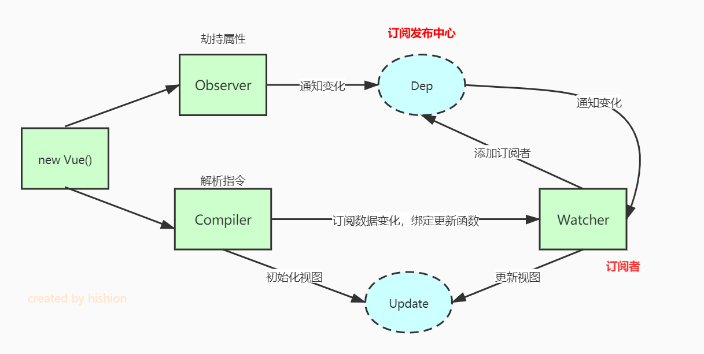

# Vue原理解析

## 基于数据劫持双向绑定
- 利用```Proxy```或```Object.defineProperty```生成的```Observer```对对象、对象属性进行劫持，在属性变化后通知订阅者```Watcher```
- 解析器```Compiler```解析模板中的指令，收集指令需要的数据和方法，等待数据变化时重新渲染
- ```Watcher```连接```Observer```和```Watcher```，接收```Observer```产生的数据变化，并根据```Compiler```提供的指令进行视图渲染，促使视图变化


Vue 3开始使用```Proxy```实现双向绑定，因为```Object.defineProperty```有如下缺点：
1. 不能实现数组和对象的部分监听情况。无法监听数组下标的变化，导致Vue实现数组变异方法来解决问题。无法监听属性的新增删除操作，需要```Vue.set```。
2. 需要遍历所有的属性，如果 vue 对象的 ```data/computed/props``` 数据多，遍历自然会慢很多。
那么 ```Object.defineProperty``` 需要监听所有的属性的变化，占用内存相应就大了。

Proxy直接拦截/代理对象，不需深度遍历属性，而且支持监听数组变化。
## computed工作流程
```js
export default {
  data() {
    return {
      message: ''
    }
  },
  computed: {
    reversedMessage() {
      return this.message.split('').reverse().join('')
    }
  }
}
```
1. ```data``` 属性初始化 ```getter``` ```setter```
2. ```computed``` 计算属性初始化，提供的函数将用作属性 ```vm.reversedMessage``` 的 ```getter```
3. 当首次获取 ```reversedMessage``` 计算属性的值时，```Dep``` 开始依赖收集
4. 在执行 ```message``` ```getter``` 方法时，如果 ```Dep``` 处于依赖收集状态，则判定 ```message``` 为 ```reversedMessage``` 的依赖，并建立依赖关系
5. 当 ```message``` 发生变化时，根据依赖关系，触发 ```reversedMessage``` 的重新计算

## watch原理
```watch``` 监听实现利用遍历获取属性，触发“数据劫持get”逐个收集依赖，这样做的好处是其上级的属性发生修改也能执行回调。

与 ```data``` 和 ```computed``` 不同，**```watch``` 收集依赖的流程是发生在页面渲染之前**，而前两者是在页面渲染时进行取值才会收集依赖。

```computed``` 和 ```watch``` 的异同：

1. ```computed``` 要依赖 ```data``` 上的属性变化返回一个值，watch 则是观察数据触发回调；
2. ```computed``` 和 ```watch``` 依赖收集的发生点不同；
3. ```computed``` 的更新需要“渲染Watcher”的辅助，watch 不需要。